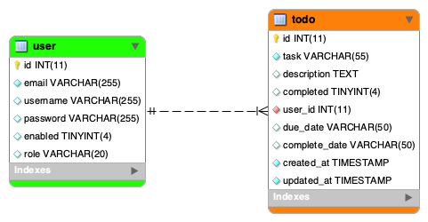
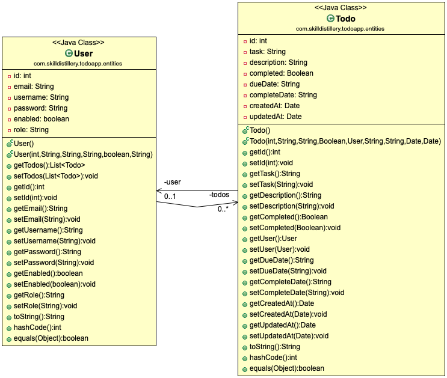

---
# TodoApp
### Full Stack Project for Skill Distillery

## Overview
This application implements full C.R.U.D functionality, using Spring Data JPA, RESTful services, and Angular 8. It was developed as part of a lesson for the course.

## Program Purpose and Functionality
The purpose of this program is to allow a user to create a list of tasks for which to track, identify a due date, as well as indicate task completion. 

## How to Use
Users are prompted to register or login. Once logged in, they are prsented with their Todo list for which they can add or delete tasks.

## Technologies Used
Java, SQL, Typescript, Angular, Spring Tool Suite, Hibernate, MySQL, VS Code, Spring Boot, Gradle, C.R.U.D, Bash Terminal, Github, Postman, MAMP, Bootstrap, Apache Tomcat, Amazon Web Services (AWS), MacDown, Atom

## Entity Relationship Diagram

## UML Diagram

